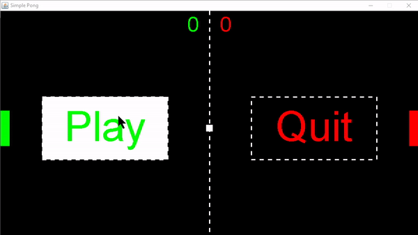

# SimplePong

I made a simple game like Pong in Eclipse with Java.

[Click here to see the YouTube playlist.](https://www.youtube.com/playlist?list=PL7g8l3pNV7-aVAJHzHBj73L1lYbcgZTxD)\
[Click here to read the Pong article on my website.](https://www.coding-heaven.ml/post/_pong)

There are 5 very short and intuitive classes in this game:

* __Game.java__ handles the rendering and physics updating using a seperate thread. It contains all the objects. This class extends Canvas to draw and implements Runnable to run the game loop.
* __Window.java__ handles the JFrame and adds the Game Canvas into it.
* __Ball.java__ contains the properties for the ball that bounces around.
* __Paddle.java__ contains the properties for both paddles
* __KeyInput.java__ handles the key input in a clever way to avoid the paddles from bugging when the direction changes.
* __MainMenu.java__ displays a main menu at the start of the game.

The final product looks like this:

